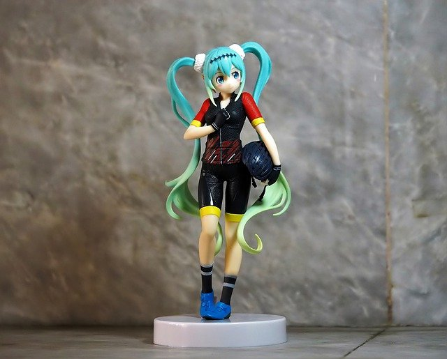
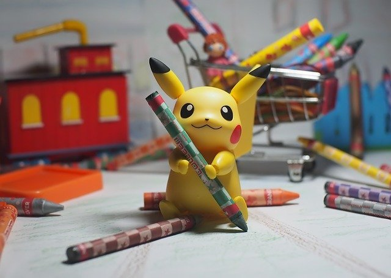

<!DOCTYPE html>
<html>
 <head>
   <meta charset="utf-8">
   <title>amiiro's favarite music</title>
   <link rel="stylesheet" href="autput.css">
 </head>
 <body>
   

     
amiiro's favarite music♬

     

     

       <ul>
         <li>好きな音楽ジャンル</li>
         <li>好きな曲</li>
         <li>お問い合わせ</li>
       </ul>
     

    

  

    <h1>Welcome to my site！</h1>
  

  <h3 class="section-title">あみいろが好きな好きな音楽ジャンルは？</h3>
  

    
    
ボーカロイド

  

      
&nbsp;

  

    
    
アニソン

  

      
&nbsp;

  

    
    
バンド

  

      
&nbsp;

    <h3 class="section-title">あみいろが好きな曲は？</h3>

    

      <ul>
        <li>ボーカロイド♪</li>
        <li>セカイ</li>
        <li>クレヨン</li>
        <li>太陽系デスコ</li>
        <li>炉心融解</li>
      </ul>
    

    
&nbsp;

    

      <ul>
        <li>アニソン♪</li>
        <li>炎</li>
        <li>紅蓮華</li>
        <li>世界は恋に落ちている</li>
        <li>ヒトリゴト</li>
      </ul>
    

    
&nbsp;

    

      <ul>
        <li>バンド♪</li>
        <li>だから僕は音楽を辞めた</li>
        <li>八月、某、月明かり</li>
        <li>イエスタデイ</li>
        <li>インフェルノ</li>
      </ul>
    

      
&nbsp;

  

  <h3 class="section-title">お問い合わせ　※皆さんの好きな曲を教えてください</h3>

  
メールアドレス(必須)

  <input>

  
お問い合わせ内容(必須)

  <textarea></textarea>

  <input class="contact-submit" type="submit" value="送信">

  
&nbsp;

  
amiiro's favotite music♬

 

　

</body>
</html>
